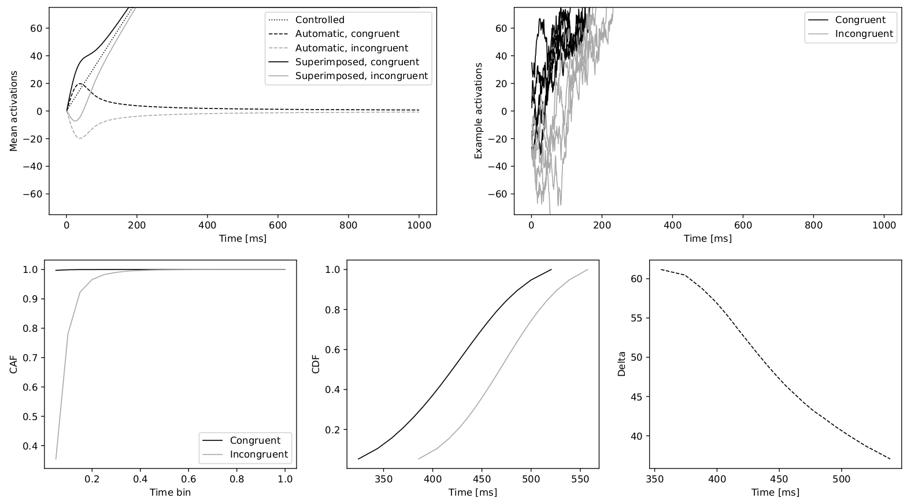

# DREAM
## Dual-Route Evidence Accumulation Model for conflict tasks

  
    
This repository contains the code from [1]. Refer to the paper for a detailed explanation of the model. If you make use of this code, please cite as follows:

**López, F.M., Pomi, A. Inhibitory dynamics in dual-route evidence accumulation account for response time distributions from conflict tasks. *Cogn Neurodyn* (submitted)**.

## Installation

DREAM runs on [Python 3.10](https://www.python.org/downloads/release/python-3109/). We recommend using [Miniconda](https://conda.io/miniconda.html) to create an environment with the required libraries:

- [Numpy](https://pypi.org/project/numpy/1.22.4/)
- [Scipy](https://pypi.org/project/scipy/1.9.0/)
- [Scikit-learn](https://pypi.org/project/scikit-learn/1.1.1/)
- [Scikit-optimize](https://pypi.org/project/scikit-optimize/0.9.0/)
- [Matplotlib](https://pypi.org/project/matplotlib/3.5.2/)

First, fork the repository into your own github account. Open a terminal in your computer, navigate to a work forlder, and clone the repository:

`git clone "URL_OF_YOUR_FORKED_REPOSITORY`

Navigate to the newly created DREAM folder and create a virtual environment with the [required libraries](requirements.txt):

`conda create -n DREAM --file requirements.txt python=3.10`

Activate the virtual environment:

`source activate DREAM`

You should now be able to run the code. If you encounter any problems during installation, please [open an issue](https://github.com/franmlopez/DREAM/issues).

## Monte Carlo simulations

To run DREAM or DREAMs, execute the corresponding file from the terminal with the `-r` flag. You can use arguments to specify the different parameters of the model. See the code for details on all the arguments.

For example, to reproduce Fig. 1 from the paper (delta plot with positive slope), execute the following:

`python dream.py -r --save_name=positive_delta --n_sims=1000000 --params 0.1 0.4 0.0001 5 0 75 10 10 300 30`

And to reproduce Fig. 2 from the paper (delta plot with negative slope, shown in header), execute the following:

`python dream.py -r --save_name=negative_delta --n_sims=1000000 --params 0.9 0.4 0.003 5 0 75 10 10 300 30`

## Fitting experimental data

To fit the model to experimental results, you need to provide the data (using the `--data_file` argument), as well as initial estimates for the parameters. This can be done manually (`-m` flag) or automatically (`-a`). Then the fitting optimization is performed with the `-f` flag.

### Sample data

The folder [sample data](sample_data) contains the experimental data collected by Mittelsdädt et al. [2] and preprocessed for use with this code. For example, to fit DREAMs to the Eriksen–Speed data of [2], first run a manual search with any set of parameters:

`python dreams.py -f --data_file=sample_data/eriksen-speed.csv --save_name=eriksen_speed --n_sims=10000 --params 0.1 0.4 0.0001 5 0 75 10 10 300 30`

And repeat until you find a set of parameters that adequately predicts the experimental data. Then use these parameters for the fitting optimization:

`python dreams.py -f --data_file=sample_data/eriksen-speed.csv --save_name=eriksen_speed --n_sims=100000 --n_iter=100 --n_repeats=10 --params_noise=0.1 --params=0.696 0.723 3.17e-04 6.12 72.3 1.01 321 43.5`

### Use your own data

You can follow a similar procedure with your own data. To do so, each condition should be saved in its own csv file with the same structure as in the sample data files:

| TrialIndex | Subject | Congruence | ResponseTime | Correct |
|------------|---------|------------|--------------|---------|
| 160        | 1       | 2          | 579          | 0       |
| 161        | 1       | 2          | 553          | 0       |
| 162        | 1       | 2          | 491          | 1       |

Note that `Congruence=1` denotes congruent trials and `Congruence=2` denotes incongruent trials. Also, `Correct=1` denotes a correct response and `Correct=0` denotes an error. Response time should be in miliseconds.

## References

[1] López, F.M., Pomi, A. Inhibitory dynamics in dual-route evidence accumulation account for response time distributions from conflict tasks. *Cogn Neurodyn* (submitted).

[2] Mittelstädt, V., et al. The time-course of distractor-based activation modulates effects of speed-accuracy tradeoffs in conflict tasks. *Psychonomic Bulletin & Review* 29.3 (2022): 837-854.

## License

This project is licensed under the MIT License – see the [LICENSE](LICENSE) file for details.